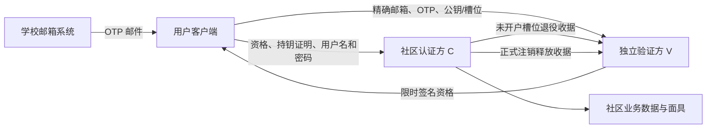

# Hnuhole 认证隐私跨方威胁模型与审阅门槛

日期：2026-09-28。状态：**实施前内部威胁建模；不是独立安全审计、代码测试或上线批准。** 适用范围为[架构决策](auth-privacy-architecture-decision.md)、[注册／释放协议](auth-privacy-registration-protocol.md)、[独立恢复策略](auth-privacy-recovery-decision.md)和[逻辑数据／API 契约](auth-privacy-data-api-contract.md)。这次审阅发现的规格缺口已写回这些文档；V/C OpenAPI与[迁移设计](auth-privacy-database-migration-design.md)现已成稿；独立主体、实际SQL、部署、客户端实现与独立评审仍未完成。

## 1. 资产、数据流和信任边界

要保护的资产分别是：学校邮箱与 OTP；尚未消费的注册资格及客户端 `sk_boot`；C 的账号、私有用户名、密码验证值、恢复码／Passkey、会话；面具与内容的隔离；注销与配额终态；V/C 签名钥、受信钥列表及不可随旧备份回滚的提交证据。只保护“邮箱—账号映射”而忽略 V 单独持有的邮箱或 C 单独持有的内容，不符合用户的隐私目标。

跨越的边界是：邮件系统→客户端、客户端→V、客户端→C、V→C 退役、C→V 释放、C 认证库→业务库、双方日志／备份／运维、移动端发布链。`slot_id` 在 V 和 C 均可见；它是**可直接 JOIN 的共同键**，不是盲凭证。RFC 9576 提醒隐私性质依赖参与方部署、发行元数据与侧信道；本项目没有采用 Privacy Pass 盲券协议。[RFC 9576](https://www.rfc-editor.org/rfc/rfc9576.html)

| 对手或失效 | 能力边界 | 可承诺的结论 |
| --- | --- | --- |
| 完全恶意的 V／校邮方 | 伪造或拒发 OTP、签任意新公钥与新槽位、探测槽位是否开户 | 可造假新资格、抢邮箱配额或拒绝服务；在 C 与客户端诚实且不掌握旧号密码／独立恢复凭据时，不能只靠邮箱控制权接管**已存在**账号 |
| 恶意 C 或被 C 更新篡改的客户端 | C 看账号与内容，可在自己发布的客户端中索取邮箱 | 不承诺对恶意 C／恶意客户端的邮箱匿名；双主体分权不能替代客户端完整性审查 |
| V+C 串通、共同运维或两库同时泄漏 | 读取双方共同槽位、网络时间、日志和备份 | 可直接得到当前邮箱↔账号映射；历史材料可能连接已注销账号 |
| 只泄漏 V 数据 | 得到邮箱、当前槽位和短期校验状态 | 没有 C 的账号映射，但**邮箱本身已泄漏**；OTP 的六位验证值须靠数据库外 HMAC 密钥保护 |
| 只泄漏 C 数据 | 得到账号、面具、内容、密码验证值和槽位 | 没有邮箱原文，但内容本身可能自我识别，弱密码还可能被离线猜出 |
| 设备、同步账户或 Bearer 泄漏 | 读取本地会话、恢复码或同步 Passkey | 可发生账号或内容访问损失；“一个有效移动会话”不等于令牌不可复制，直到在线撤销成功前已泄漏 Bearer 可被重放 |

“一个邮箱一个账号”仅指**诚实 V 下同一精确地址同时至多一个有效账号**。别名、大小写、共享邮箱及一个人多个邮箱不在这条保证内。私有用户名只是不公开展示；拥有合法校邮资格的普通客户端也能通过受限注册尝试探测候选用户名占用，限速只能约束成本，不能证明用户名不可枚举。

## 2. 必须保持的不变量

1. **旧号控制权独立：**OTP、V 签名资格、退役／释放收据与 `sk_boot` 均不能登录或重设已有账号；只有当前 C 密码或预设独立恢复凭据可控制旧号。
2. **新号资格有时效：**C 创建待开户意图和最终提交时均检查 V 签名的 `REGISTER/V2` 三十分钟准入桶，只接受本桶或上一桶；过期必须重新收码，同一未消费槽位／公钥可换签，失去私钥则走退役。C 时钟倒退或灾备无法确认可信 UTC 时冻结验票，不能让旧资格复活。
3. **槽位终态单调：**同一槽位只有 `ABSENT→ACTIVE/RETIRED` 一方能提交；`ACTIVE→CLOSED` 后不能重新开户。V 只按当前槽位匹配已提交退役／释放收据开放精确邮箱配额。票据有时效不允许删除长期终态，因为失陷 V 仍可重新签旧槽位。
4. **恢复意图唯一：**每账号同时只有一个活动重设意图；初步验证的旧码／Passkey 在账号锁内须再次核对仍是当前凭据及原版本，替换意图再废弃旧意图。最终重设同时核对凭据版本和意图代次；成功后旧恢复码、全部旧 Passkey 和会话失效。
5. **会话撤销有效：**新请求在同一权威事务的最终授权点验证会话代次、撤销、账号与封禁。已持久接受的后台任务只凭已提交的不可修改内容清单继续，不能借旧令牌接收新请求；公开前还须复查注销、禁言与封禁。申请注销后不得再公开待发任务。
6. **七天截止有界：**`due_at` 到达后，即使关闭 worker 尚未运行，也不能再主动登录取消、重设或写入；截止按账号锁下实际时间 `clock_timestamp()` 裁决，不能按事务开始时间。C 真正提交 `CLOSED` 前不签释放收据。状态页可区分 `FINALIZING` 与已关闭。
7. **灾备与密钥撤销单调：**从旧备份恢复期间冻结认证与受保护操作，核对账号、槽位、凭据、会话、释放和受信钥撤销版本，旧会话全撤销；旧配置不能重新信任已撤销的签名钥。

## 3. 攻击路径与结果

| 编号与路径 | 预期结果／剩余风险 | 必须验收的证据 |
| --- | --- | --- |
| T01 V 自签新公钥／新槽位建假账号 | 用户已接受：C 无法独立判断新资格真假；**不能**因此把旧号密码重设交给 V | 自造资格可建新号；同一旧账号的密码／恢复凭据和内容不被转移 |
| T02 V 把用户槽位改绑 V 的公钥；或外部客户端提交单位元／小阶公钥 | C 重算槽位散列并拒绝换绑；V 与 C 均须拒绝弱点公钥及非规范签名，否则 PoP 退化为 bearer | 同槽位不同公钥、单位元／小阶／非素数阶公钥、非规范 `R/S` 的负向向量均失败。严格验签应符合所选 [RFC 8032](https://www.rfc-editor.org/rfc/rfc8032.html) 实现配置 |
| T03 旧邮箱持有人保留未消费资格和私钥，失去邮箱后再开户 | 限时票据把风险压到 OTP 完成后的约三十至六十分钟；超过窗口 C 拒绝，不可仅靠 V 内部 TTL；C 时钟回退会复活旧票，必须先冻结与校时 | 跨桶边界、V 比 C 快数秒的原票短时重试、C 意图创建前和最终提交前过期均测试；灾备时钟回退仍拒旧票 |
| T04 旧资格重放、并发开户／退役、C 回包丢失 | 槽位终态与 C 原子约束只让一个结果提交；V 退役待办在发 C 请求前持久化，回包丢失不续旧票 | 并发与故障注入后恰有一个 `ACTIVE/RETIRED`；V 不因超时、旧收据或 OTP 到期自行开放配额 |
| T05 C 释放收据私钥泄漏或退役待办与关闭释放交错 | 伪造收据可错误开放配额，须按密钥失陷事故冻结与核对；真实 `RELEASED` 先到须终结待办，迟到拒绝不得恢复旧配额 | 吊销密钥、冻结受影响操作、核对双号；交错顺序和回包丢失测试 |
| T06 六位 OTP 猜测、撞库与用户名枚举 | 每码跨设备最多十错、设备三错五分钟与跨流程精确邮箱滚动预算叠加；密码另用 Argon2id、弱密码阻止名单与限速。用户名不保证不可枚举 | 测定具体邮箱级发码／验证阈值与误伤；多设备、多 IP、多 `flowId` 批量猜码、密码喷洒和用户名探测测试 |
| T07 旧恢复码或 Passkey 被盗；攻击者先取重设意图 A，用户后建意图 B | 单次被盗凭据本身可夺号；但 B 原子废弃 A，A 不因持相同凭据版本仍可提交。初步证明后若旧凭据已被轮换，不能借新版本创建意图。成功重设撤销全部旧恢复路径 | A/B 并发替代、证明后等待账号锁期间轮换旧码／Passkey、重设与凭据管理交错；重启后用已持久保存的原键查无秘密结果；过期结果核对与迟到 POST 争同一账号锁，只能得 `COMMITTED/NOT_COMMITTED` 中一种 |
| T08 会话 Bearer 被复制、退出响应未知 | 复制的 Bearer 在服务器撤销前仍可能用；客户端持久标记绑定旧令牌的登出待办后只留单向导出的 `SessionRevoke` 秘密，不能用待办继续访问社区 | 崩溃发生在标记、导出秘密、删 Bearer 的每一间隙；重启先处理待办；`503`／断网重试只撤旧会话，不影响新会话 |
| T09 注销申请响应丢失、早到状态 `404`、到期 worker 延迟 | 早到 `404` 非最终结果；相同 `closureId` 重试且状态秘密不丢；申请赢得账号锁后阻断未公开任务，到期后阻断旧号，真正关闭后才释放 | 双 POST 同 ID、GET 先于 POST 提交、事务在截止前开始但截止后才得锁、截止前后登录／封禁／重设竞态测试 |
| T10 旧备份与旧受信钥配置回滚 | 没有外部可信提交证据时持续冻结，不能恢复旧票、旧密码或被撤销的密钥 | 模拟 V/C 不同恢复点、旧会话、旧签名钥和释放 outbox 丢失，核对前所有敏感路由关闭 |
| T11 V/C 共享 CDN、请求 ID、诊断 SDK、运维账户或客户端上传邮箱 | 超出“单侧数据库无完整映射”的宣传边界；即使没有 JOIN，IP／时间、日志与应用更新也可泄露 | 双方独立权限、密钥、备份、监控；检查客户端与服务端真实请求／日志，C 无邮箱且请求 ID 由本方生成 |
| T12 旧设备在会话撤销后补传不同图片，或已受理帖在禁言／封禁后公开 | 受理事务固定正文与图片散列清单，受限上传只能补原字节；公开前与账号锁串行复核处罚和注销状态 | 替换图片、超量上传、乱序、散列不符、撤销后上传、禁言／封禁及注销与公开入库交错测试 |

T03、T07、T08、T09、T12 与严格 Ed25519 验证是本轮发现并修订的**规格缺口**，不是已在运行系统复现的漏洞。T01、T05、T08、T11 是必须向用户和独立审计方说明的**剩余风险**。网络时序与同步 Passkey 服务商元数据仍可能帮助关联；对外不能写“绝对匿名”。

## 4. 当前代码与运营差距

当前 Go 切片仅有通道目录的演示会话校验：[会话查询](../../services/api/internal/auth/postgres.go)、[会话迁移](../../services/api/migrations/0001_sessions.sql)没有新账号终态、封禁、代次或注销事务；[请求编号中间件](../../services/api/internal/httpapi/router.go)接受客户端 `X-Request-ID`，与“V/C 各自生成不可共用请求编号”的目标不符。**不得把当前中间件当成生产认证完成品接入新业务写路由。**这些是实施迁移清单，不表示本轮修改了代码。

生产前须拿到可检查的运营证据：V 与 C 的独立法律／运营主体、管理员与云控制面分离、各自签名私钥和备份、双边最小权限及交叉访问审计；移动 App 的发布权限、版本签名、依赖／遥测与隐私字段检查也须纳入评审。若 C 独自控制可远程更新的客户端，C 能让客户端上传邮箱，单靠服务端分库不能保证用户对 C 匿名。

## 5. 交给独立评审方的门槛

| 门槛 | 应交付的可核对材料 |
| --- | --- |
| G1 协议和数据 | 已成稿的[V OpenAPI](../../packages/openapi/verifier-auth-api.yaml)、[C OpenAPI](../../packages/openapi/community-auth-api.yaml)及[迁移设计](auth-privacy-database-migration-design.md)；尚须可执行签名字节／严格Ed25519负向向量、实际SQL唯一约束和并发／隔离验证 |
| G2 并发与故障 | 注册／退役／释放状态机测试、跨桶与时钟回退、超时重放与丢回包、旧恢复证明在锁前失效、重设意图替代、客户端重启后的登出／重设核对、七天截止、媒体清单与处罚交错、签名服务中断、旧备份与旧密钥配置恢复演练 |
| G3 在线攻击 | 校准后的每邮箱发码与验证预算、设备与网络限速、密码喷洒和用户名探测结果；无法仅凭“统一错误文案”判定不可枚举 |
| G4 隐私和留存 | V/C 数据字段、日志／WAL／备份保留上限及清理演练、共享运维和云依赖审计、客户端实际包及遥测检查、发布和密钥撤销权限矩阵 |
| G5 用户可理解性 | 恢复码保存与全凭据遗失后同邮箱也被锁住的用户测试；同步 Passkey 元数据取舍和恢复事件无法保证异地通知的清晰提示 |
| G6 独立结论 | 与方案作者及 V/C 实施团队不同的安全评审人签署范围、发现、复测证据和接受的剩余风险；该签署前不宣称通过独立审计 |

这些门槛参考 [OWASP 威胁建模指南](https://cheatsheetseries.owasp.org/cheatsheets/Threat_Modeling_Cheat_Sheet.html)的信任边界与数据流审查、[RFC 9576](https://www.rfc-editor.org/rfc/rfc9576.html)的部署和侧信道边界，以及 [NIST SP 800-63B](https://pages.nist.gov/800-63-4/sp800-63b.html)的恢复码与通知要求。Hnuhole 当前不声称符合某个 NIST 认证等级；没有独立通知地址时也无法保证恢复事件到达已丢失设备之外的用户。
