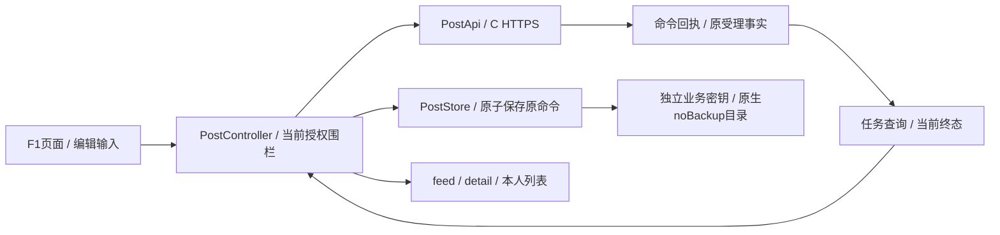

# F2：Flutter 文字社区契约与本机存储设计

日期：2026-10-09（Asia/Shanghai）。分支：`codex/community-flutter-pages`。
状态：`DESIGN_COMPLETE / F3_IMPLEMENTATION_NOT_STARTED`。F1 基线 `0fa944f68b0a46e08be757913f24f8c235731b7f`；发布契约与复用源码基线 `514a944560988e3d8d599e6f9fe9d5d99fe07f88`。本轮不实现页面、业务适配器或原生存储；本分支功能与平台测试均 NOT_RUN。

## 1. 版本与交付边界

本轮已 fetch 并核对两条远端，前端 F1 与本地一致；后端远端仍为上述 T3 提交。OpenAPI 最后变更为 T2 `0644f5ae5ef0c92ae99ed81fd40dac97ed447bc3`，版本0.1.0。本分支保留[同字节 OpenAPI](../../packages/openapi/post-api.yaml)、[协议向量](../../packages/post-protocol-vectors/post-command-v1.json)及[锁定清单](community-flutter-f2-lock.json)，避免依赖另一工作树的可变文件。

后端已发布 T1/T2/T3 包含现成 PostApi、HTTP adapter、models、protocol、controller、Drift PostStore 和独立业务 vault。F3应审查后复用，按F1已批准画面重接页面，不再次从头实现同一协议或存储。源代码位置及精确摘要在清单中；它们在本分支仍是待导入参考，不能称本分支已经实现。

后端目前未提交的 T4/page 验收、controller/screens修改不进入此锁定。已发现“删除丢响应后核对成功仍显示正文”的修复尚在该工作树；F3必须等待对应提交或独立复现修复，补入回归后才能交付，不能用514a944冒称已含修复。最终认证候选仍待固定，F4依赖不由F2代完成。

F1已经完成：[22场景清单](ui-reviews/f1-completion-audit.md)为19正式PNG＋2已定布局复用＋1返回动作。本人删除成功直接回来源页并更新列表，未确认成功保持核对；完整图中的图片、标签、赞藏、搜索、消息等没有本文字API。F3保持图稿资产，不添加假图片／计数／不可用的数据；尚未实现入口遵循本片已有启用范围，完整视觉实现需相应后续契约。白色及暗灰蓝按批准页面适配，不改图或全局定色。

## 2. 数据流与职责

PostApi只定义实际发布契约，不接受客户端 accountId/ownerId 或可选V origin。PostStore保存本机编辑及原命令锚点，不是服务器权威。PostController负责令牌／账号／授权代次、界面选择和原结果核对；页面不直接拼HTTP或写数据库。公共内容、本人管理、草稿／失败重试缓冲、命令回执分成不同类型，不共享一个全字段DTO。

## 3. 14个接口及返回类型

全部使用固定部署 C HTTPS origin、当前Bearer，成功返回Server-Time、Session-Expires-At、X-Request-ID、no-store。Idempotency-Key与CREATE路径commandId共用账号内命令键域；不是按token重新生成域。

| PostApi方法 | HTTP | 输入／结果 |
|---|---|---|
| create | PUT /api/v1/post-commands/{commandId} | channelId/identityId/title/body；202 PostCommandResult |
| commandResult | GET /api/v1/post-commands/{commandId} | 原命令事实；200 PostCommandResult |
| seal | POST /api/v1/post-commands/{commandId}/seal | operation/requestDigest；200 PostCommandResult |
| composerContext | GET /api/v1/me/post-composer-context | ComposerContext权威默认身份 |
| tasks | GET /api/v1/me/post-tasks | cursor/limit；PostsPage<PostTask> |
| task | GET /api/v1/me/post-tasks/{taskId} | 当前latest PostTask |
| cancel | POST /api/v1/me/post-tasks/{taskId}/cancel | 新命令键＋expectedAttemptVersion；PostCommandResult |
| retry | POST /api/v1/me/post-tasks/{taskId}/retry | 新键＋原版本＋title/body；202 PostCommandResult |
| hide | POST /api/v1/me/post-tasks/{taskId}/hide | 新键＋原版本；仅明确FAILED本人入口 |
| feed | GET /api/v1/channels/{channelId}/posts | cursor/limit；PostsPage<PostCard> |
| detail | GET /api/v1/posts/{postId} | PostDetail正文；无viewer权能 |
| ownPosts | GET /api/v1/me/posts | PostsPage<OwnPostCard> |
| capabilities | GET /api/v1/me/posts/{postId}/capabilities | PostCapabilities；非本人／不存在统一404 |
| delete | POST /api/v1/posts/{postId}/delete | 新键，无body；PostCommandResult，不使用DELETE路径 |

类型和JSON schema以OpenAPI为准，DTO allowlist严格解码，不序列化数据库行。公共card只有postId/channelId/title/author/publishedAt，detail增加body。公共作者ACTIVE只有state/avatar/nickname；DELETED／ACCOUNT_CLOSED只有state/avatar/shortCode。禁止identityId、accountId、slot、本体标记、其他身份、共同关系及可枚举资料。

inactive短码为12位A-Z2-7，头像inactive-v1，显示“注销身份 · 短编号”；点击分辨删除／注销。active为default-v1；自定义图片头像不因F1示例而提前实现。详情capabilities独立私有查询，canDelete=true/canEdit=false只是展示条件，服务端每次再授权。

本人task字段涉及taskId/postId/channelId/identityId、latest attemptVersion、state、serverSortAt、终态时间、visible/contentAvailable、canCancel/canHide/canRetry及可用content。不要把canX当永久能力。contentAvailable=false时清当前缓存，不用旧全文补显示。ComposerContext三态INITIAL_SETUP_REQUIRED/DEFAULT_AVAILABLE/SELECTION_REQUIRED；资料取本人identities，不能按列表第一项／消息收件身份猜默认。

## 4. 状态与原结果核对

| 命令状态 | 客户端处理 |
|---|---|
| UNKNOWN_NOT_OBSERVED | 本次未观察到，保留不可变payload；只核对或原ID同意图重送；不解锁为草稿 |
| ACCEPTED | create/retry原受理事实；关联task/post/version，再读当前task |
| COMMITTED | 维护命令裁决；结合operation与事实，不统一画“发帖成功” |
| REJECTED | 原持久拒绝，旧ID不再尝试别的payload；明确拒绝与网络错误区分 |
| NOT_ACCEPTED | 原ID已封印，迟到请求不能受理；明确结束该提交，不自动新发 |
| RESULT_EXPIRED | 不推断失败或未受理，保留compact锚点、停止自动重送；只在可取得权威task或人工恢复条件下解决 |

任务只存在ACCEPTED/PUBLISHED/FAILED/CANCELLED。UNKNOWN是客户端观察状态，不写成服务端终态。历史CREATE受理可能对应后来FAILED、CANCELLED或已删帖；成功提示只在确认PUBLISHED且当前可见时出现，不因读历史回执重复弹成功。

本机entry主状态沿用已发布store/controller协议：draft为普通草稿；submitted为已经持久原命令的操作，其结果观察可以未知；业务终态与retry编辑缓冲另记录。显示“失败草稿”是一种画面文案，领域仍为固定身份／通道的失败任务，不能放回普通草稿。精确参考state集合见锁定controller/store，不发明与已有v1不兼容的磁盘枚举。

确认发布顺序：验证可见字符／当前选择 → 生成CSPRNG16字节非零base64url命令键 → 严格fields生成摘要 → 同一SQLite事务保存不可变尝试及唯一索引 → 写入成功后后台发原命令并直接回通道。存储失败不发送、留输入。连续点击复用同一动作；超时、断网、503、非法响应不清原上下文。

明确取消未知CREATE时先seal原命令及摘要；NOT_ACCEPTED结束，已ACCEPTED则针对实际task/attempt另发cancel，PUBLISHED不能由seal/cancel删帖。取消成功才移除处理中入口；成功公开先赢保持成功。retry仅FAILED且canRetry/contentAvailable、当前身份许可：创建新attempt、新命令键，仍锁定原identity/channel。hide仅明确失败，清入口而保留compact原事实。

作者删除是独立POST命令。丢响应核对同一删除键；权威COMMITTED后清详情正文、本人／feed项目和读取缓存，通知页面直接pop来源页；只保留来源列表可用锚点。未确认时不pop并宣称已删除；已删详情统一不可读。重复删除复用已观察原结果，不再向缺失帖子重复创建命令。

命令摘要严格复用协议向量：ASCII域＋00＋operationByte＋UUID16／uint64BE版本／UTF8长度帧；不hash JSON序列化，不trim、不自行Unicode正规化，标题/正文原字节参与。标题15、正文3000按用户可见字符；纯文字片正文必填，空白语义沿服务端验证。JSON字段顺序不影响摘要，CR/LF、前后空格会影响。

## 5. 错误、会话与分页

| 情况 | 固定动作 |
|---|---|
| 401 / 接替 | 走既有sessionUnauthorized；立即隐藏受保护内容，保留原账号本机隔离数据 |
| 503 / Gate / 网络超时 | 暂停访问和自动操作；保留恢复上下文，不能当账号关闭或任务失败 |
| 429 | 按Retry-After 1–300秒退避；不能新建命令躲限流 |
| COMMAND_CONFLICT / 版本冲突 | 停止盲重送，核对原命令／latest任务，不改payload沿用旧ID |
| CURSOR_INVALID | 当前分页不可继续；提示刷新开启新分页，保留可用阅读锚点 |
| 404 detail/capabilities | 通用不可访问；capabilities404不必然清别人公开详情，detail404则不可恢复旧正文 |
| 400/403/409等 | 按契约code映射；错误HTTP本身不代证已持久REJECTED，必要时核对原command |

每次async工作捕获不可变accountId/token/session authorityVersion、controller epoch、store实例，await后先复核，过期响应不写新会话／账号、不更新新页面、不续期旧令牌。successful metadata先经当前会话回调持久化；不能仅更新内存expiry。日志只用固定类别、有界code和requestId，不输出正文、原命令ID/摘要、Bearer或底层路径异常。

分页limit默认20、最高50。cursor不透明，不解码修改；作用域channel/own/tasks、账号和30分钟服务端截止绑定。每一页复核当前可见性。公开发布时间／序号ceiling与task acceptance ceiling各自独立，retry可能让旧分页task消失，刷新后才显示新attempt。不是客户端拼接“稳定旧内容快照”。

本人混排用服务端publishedAt/serverSortAt与本机草稿editedAt，稳定私有ID辅助锚点，logical entry关联task/post去重。任务排序按latest受理时间，不用后台失败时间置顶。已删身份公开旧帖从本人列表移除，仍可从通道开并查询最小删除权。自己的新帖成功插入最新列表但不强制回滚，其他新内容按刷新加载。本片置顶能力没有接口，不造置顶按钮。

## 6. Drift／加密存储 v1

保持既有实现，不新选SQLCipher，也不把business全文塞AuthStore。锁定characters1.4.1、crypto3.0.6、cryptography2.7.0、drift2.35.2、sqlite3 3.7.0，依赖与hosted SHA见锁定清单。F3导入pubspec和对应完整pubspec.lock并运行pub解析/分析；F2仅检查已发布锁存在且版本一致，不假称本分支已解析依赖。Dart3.13.4和Flutter3.47.5最低基线仍沿项目。

Drift NativeDatabase放后台isolate；mobile sqlite3构建hook使用官方bundle，Linux测试可用系统库。不另装sqlite3_flutter_libs；此选择与已发布源码及[Drift平台文档](https://drift.simonbinder.eu/platforms/)一致。本轮没有下载SDK／重建大缓存。

scopeFor = SHA256(UTF8(JSON(["hnuhole.business.v1", environment, accountId])))。environment保持已发布main的精确字符串规则：hnuhole.isolated.auth.v1|$communityBaseUri|$verifierBaseUri。两URL来自可信部署配置，启动时校验固定HTTPS origin；不从页面／用户输入、不跟随Bearer变动。V URL只参与本机环境域，不向V发送业务。禁止静默正规化现有URI字符串；将来改canonicalization必须显式迁移scope／namespace，不能造成旧库突然不可见。accountId来自恢复后权威CurrentSession；仅内部使用、不写公共UI／DTO／日志。

三个表保持[设计DDL](schemas/community-posts-local-v1.sql)与已发布PostStore一致：
- post_meta(scope,payload)：认证密文包含schema1/scope/closed。
- post_entries(id,revision,state,payload)：本机logical id、正revision、粗粒度状态；data＋intents均在payload密文。现候选的失败重试buffer id含taskId／attemptVersion，不应把它说成随机ID。
- post_command_index(command_tag,entry_id)：command_tag为业务key的HMAC(JSON(["post-command-v1",scope,commandId]))，不存原命令明文；事务防止跨entry复用。

标题／正文、原命令／payload／digest／编辑时间以及通常的identity/channel/post引用在密文内。已发布候选却以retry-taskId-attemptVersion作重试buffer行键，暴露私人任务编号和版本；F2锁定修复要求，F3改用CSPRNG随机logical id并在密文内维护task/version关联。旧buffer重命名须在事务内重加密（AAD绑定id）、迁移引用及索引，保留原intent/digest/终态与恢复关系，失败保留旧库；不能简单删缓冲或重发。外部仍可见scope hash、row数量、revision和粗状态；这不是整文件加密，不承诺消除长度和状态元数据。数据AES-256-GCM，每次新nonce，封装version1＋12byte nonce＋ciphertext＋16byte tag。AAD严格JSON(["hnuhole.posts.payload",1,environment,accountId,scope,id,revision,state])，避免跨行、账号、环境和revision替换。行加密不证明完整旧库快照回滚已被阻断，服务端原命令核对仍为权威。

BusinessKeyVault读／write，只用于独立32byte业务key；DurableBusinessVault原生businessRead/businessWrite/businessDatabasePath/businessPurgeClosedAccount，认证namespace/schema保持。Android在noBackupFilesDir/hnuhole-business-v1，业务Keystore alias与记录目录独立，原生auth/business共用processLock进行跨engine串行访问；iOS业务Keychain service／ThisDeviceOnly与不备份目录单列，平台仍待验。原生创建路径、只写一次key、ack回读，Dart不自行用文档目录或明文/内存fallback。

PRAGMA DELETE journal、FULL synchronous、secure_delete ON、foreign_keys ON、busy_timeout5000。保存使用transaction＋revision CAS，冲突刷新原记录，不覆盖另一进程。首次建库仅在“库不存在、key不存在”生成key；已有库无key、key变动、解密失败、坏schema都停写并保留文件，不自动清空生成替代key。每次操作再复核meta和key，避免闭号后仍写。新库初始化失败后有key无完整库允许按同key重试，不能把失败ack画成保存成功。

普通退出／401／冻结／resetPending/closurePending只停止显示及写入权限，不purge。持久取得权威CLOSED_RELEASE_PENDING／RELEASED后，以认证记录originalAccountId定原scope，先durable closed marker，再清单scope库/journal/wal/shm及业务key；失败保持marker和认证闭号记录并阻止打开，重启重试清理；历史缺originalAccountId不猜当前账号，不扫其他账号库，不因密钥丢失而无法清闭号账号。关闭成功不声称物理介质/WAL/系统备份已经全量安全擦除。

## 7. Schema和兼容策略

固定schemaVersion1；第一次建库执行三表，v1打开不删数据。未知未来版本／不支持的升级拒绝打开，保留原库，不drop重建。F2没有需要的v1→v2变更，故不新增空迁移或假“升级已通过”。

以后变schema应在新版本定义逐步事务迁移，保存历史DDL／真实数据fixture，升级保持每条原intent/digest/compact事实并验证解密；失败回滚/停写，不将有未决命令的库当可放弃草稿。迁移完整性检查与[Drift迁移文档](https://drift.simonbinder.eu/migrations/)共同约束；本片仍采用已发布手写GeneratedDatabase/SQL，不临时增加代码生成链。F3补schema结构校验及未来版本拒绝实盘测试，不能仅凭user_version正确认为坏库可用。

## 8. F3导入顺序与测试责任

| 顺序 | 精确来源／工作 | 验证 |
|---|---|---|
| 1 | 固定post_protocol/models/api/http adapter及向量；按锁定清单取514a944 | Dart向量、严格DTO、14操作、错误/header、cursor |
| 2 | PostStore及独立业务vault/native/hooks/依赖锁 | 真实SQLite、AEAD/CAS、无钥/坏库、同scope并发、随机retry缓冲／legacy重映射、备份路径和purge失败 |
| 3 | AuthSession/closure bridge逐补丁审查，保持F1主导航 | 账号切换、迟到回调、暂不可用与正式关闭分别处理 |
| 4 | controller复用＋F1画面接入；不覆盖正式PNG | 表单/默认身份/任务混排/未知取消/失败重试/滚动 |
| 5 | 上游删除核对修复提交或本地等价修复 | 只发一次删除、回执晚到清正文并pop、无旧缓存复现 |

F3不是整分支merge：后端已修改main、auth closure与native共享包，需要逐处对照最终认证候选。未提交T4工作树不复制；不能把已发布client结果代验前端F1新UI。锁定清单提供ref/path/hash，不授权F2扩到完整后端或手机测试。

现有参考tests为post_protocol_test.dart、post_api_test.dart、post_models_test.dart、post_storage_test.dart、post_closure_cleanup_test.dart、post_controller_test.dart、post_screens_test.dart。F3导入后在本分支用实际Flutter命令执行相应源码；F4新增当前SHA真实HTTPS/SQL，F5设备跨进程／IME/读屏/备份及故障。不发明runner的--module参数。本轮本分支业务0项执行，已有报告全部按原分支与版本保留。

## 9. F2退出条件和交接

F2完成条件：固定远端／blob与摘要；14接口及DTO/错误/状态／seal/cancel/retry/delete已映射；加密三表v1、key/环境账号/关闭/升级策略固定；依赖锁已有发布候选；F1批准与代码切片区别明确；F3源码/测试导入顺序可执行。不存在待用户决定的产品问题，无需重复访谈。

本轮检查记录见[机器记录](community-flutter-f2-verification.json)，证据只覆盖契约快照、设计一致性、Git引用和文档路径。Flutter业务／SQL链／原生设备／迁移平台仍NOT_RUN；F4最终认证整合待候选。同步HANDOFF、progress、模块交接与台账，以currentCommunityFlutterF2附加映射A12/N01/B02/B03/B05/B06/B10/X06/X07，不改历史结果或声称整个模块PASS。
