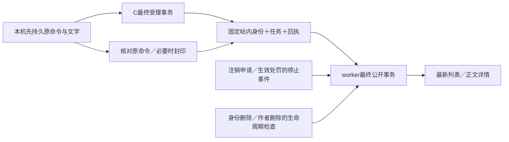

# 文字发布后端契约与事务设计（T1）

日期：2026-10-08。分支 `codex/community-text-posting`，源码基线 `0eff47a21cd4f4ab1636b4468f7d5df9769a264f`。

状态：T1服务端设计已由T2实现，源码及验证范围见[T2报告](community-text-posting-t2-report.md)；用户最新授权本会话实施T3，Flutter页面、HTTP适配、持久业务状态及独立加密SQLite／native namespace已有实际源码，精确范围见[T3报告](community-text-posting-t3-report.md)。T1/T2原证据按原版本保留。实际范围见[计划](community-text-posting-plan.md)，HTTP 唯一来源仍为 [post-api.yaml](../../packages/openapi/post-api.yaml)，调用与恢复说明见[API说明](community-text-posting-api.md)。原并行 `codex/community-flutter-pages` 任务当前承担产品图审核，未提供本轮实现；视觉未获最终批准。认证最终候选及实际C/V→Dart／完整App／平台整合仍待T4。

## 1. 领域关系与两个成功时点

图为T1设计。核对可能返回拒绝或未受理封印，此时不生成任务；worker必须通过最终权限与停止代次检查才进入公开事实。

账号私人控制权 → 本人有效身份 → 帖内身份绑定 → 帖子；发布任务属于同一个账号和帖子，每次尝试有自己的不可变文字与终态。命令回执记录某次用户操作是否受理／生效，不代替任务当前状态。

**受理成功**：最终 C 授权事务一次提交帖子内部占位、帖内身份、任务、第一次尝试及命令回执。此刻内容仍不公开。**公开成功**：worker 在后续最终 C 授权事务一次提交公开正文、发布时间／序号、尝试 PUBLISHED 和最近公开发言身份。列表只读这个公开事实。

客户端 `UNKNOWN` 只表示没拿到权威结果；服务端不会把它存为发布任务终态。CREATE 命令永远可以返回原 ACCEPTED 事实，即使该任务后来失败、取消或其帖子已被作者删除；客户端必须进一步读任务／帖子，不能把历史受理回执画成刚刚发表成功。

## 2. 已定产品规则与文字边界

- 两步发布、无身份可浏览、发送前设置身份返回原输入、默认身份、后台发送、草稿混排等沿用[发帖](modules/post-composer.md)、[身份](modules/identity.md)和[个人内容](modules/personal.md)。作者最小删除能力属于本片，编辑／审核／图片／标签交互／评论／赞藏／搜索不在本片。
- 标题和正文分别最多15／3000个 extended grapheme cluster。冻结 **Unicode 16.0.0、UAX #29 revision 45**；不使用码点数、UTF-16长度或英文词数。前端基线 `characters 1.4.0`，后端设计选用 `github.com/clipperhouse/uax29/v2 v2.4.0` 的 graphemes；T2才能加 go.mod，T3才能锁前端依赖。本轮不安装或声称实际跨端一致性已通过。
- 原文保留，不 trim、不 NFC、不大小写折叠。沿用户已接受的计数口径，空格、标点、换行也计数；CRLF按该UAX规则作为一个cluster计数，服务端不得改成LF后再计算摘要。不新增标题禁止换行规则，不把昵称的禁空格／禁emoji规则移植过来。
- 两字段必须至少包含一个不属于 Unicode16 `White_Space ∪ Default_Ignorable_Code_Point` 的标量。标题／正文全空白或只有不可见格式字符拒绝，不静默删字；普通标点、emoji与组合文字允许。非法UTF-8／孤立surrogate、NUL和C0/C1控制字符拒绝，TAB/CR/LF例外。这些检查及属性版本要有共享向量；合法未确认的IME组合文字不作为确认发表内容。
- 防资源消耗另设解码后UTF-8上限：标题4096字节、正文65536字节；JSON请求体最高256KiB（包含转义膨胀）。它们不是新的“字数”单位，错误为有界 `POST_CONTENT_INVALID`／`PAYLOAD_TOO_LARGE`，不截断后发表。
- 注销占位统一“注销身份 · 短编号”，头像 `inactive-v1`；`DELETED`／`ACCOUNT_CLOSED`只决定点击提示。短编号使用12位大写RFC4648 base32字母 `A-Z2-7`，60位随机、身份级唯一且不可变，数据库唯一冲突重新生成，不能截取账号号或共用关闭时间。现有投影token仍是内部身份级输入，不直接展示其摘要。
- T2迁移先为所有历史身份独立分配编号，之后身份创建同最终事务分配。旧活动资料改名不改编号；单独删除后再正式关闭也不换编号。同一身份跨帖可关联属于已定边界，不提供身份全部历史查询。

依据：[Unicode16 UAX29](https://www.unicode.org/reports/tr29/tr29-45.html)、[Dart characters 1.4.0](https://pub.dev/packages/characters/versions/1.4.0)、[Go uax29 v2.4.0](https://github.com/clipperhouse/uax29/tree/v2.4.0)。版本改变必须更新共享向量与客户端／服务端契约版本，不能自动跟latest升级。

## 3. 数据模型与必须由数据库保护的不变量

以下落入 C 的 `c_posts` schema；身份和账号继续引用原位置，不新建第二份认证表。由独立migrator/owner运行正式goose迁移，C runtime仅获精确DML。T1给出逻辑模型，不创建可执行迁移，不预占尚可能冲突的迁移编号。

| 表 | 核心字段 | 约束与作用 |
|---|---|---|
| account_publication_control | account_id PK/FK、stop_generation、last_public_identity_id、last_public_at、last_public_ordinal | stop_generation非负bigint单调；溢出安全停止；last_public只在公开成功更新 |
| publication_stop_events | account_id＋generation PK、stopped_at、cause | 每次stop代次推进同事务追加；generation连续递增；TrustedAt与原因不可变，仅本人内部查询，不返回共同事件标识 |
| identity_public_labels | identity_id PK/FK、short_code UNIQUE | 12位随机编号终身不可变，不含accountId；不建立公共枚举接口 |
| posts | post_id PK、owner_account_id、channel_id、visibility、published_attempt_id、published_at、publication_ordinal、deleted_at | owner/channel不可变；INTERNAL/PUBLISHED/DELETED；仅一次由INTERNAL公开，DELETED不可恢复；序号唯一，公开时间非空 |
| post_identity_bindings | account_id、post_id、identity_id、bound_at | PK(account_id,post_id)；复合FK(account_id,identity_id)指向现有身份归属，复合FK(account_id,post_id)指向posts；不可换身份/删除 |
| publication_tasks | task_id PK、post_id UNIQUE、owner_account_id、identity_id、channel_id、latest_attempt_version、owner_visible | 归属/身份/通道不可变且与binding一致；仅FAILED可由本人hide；无客户端owner selector |
| publication_attempts | task_id＋version PK、accepted_stop_generation、state、accepted_at、acceptance_ordinal、terminal_at、failure_code、content_ref | version递增；acceptance_ordinal全局唯一且在Gate内分配；ACCEPTED→PUBLISHED/FAILED/CANCELLED；终态不可倒退；同task最多一个非终态attempt和至多一次PUBLISHED |
| attempt_contents | task_id＋version PK/FK、title、body、request_digest、erased_at | 原文在受理后不可改，只能按精确不可逆erase规则清除；重试新增attempt，不UPDATE原文字 |
| protocol_keys（T2补充） | singleton=1、version=1、command_tag、fingerprint_tag | 永久固定两份防重用途密钥承诺；只INSERT/SELECT，不能替换或丢历史承诺后重绑定 |
| command_receipts | key_digest PK、owner_account_id nullable、operation、intent_fingerprint、outcome、task_id/post_id、attempt_version、error_code、committed_at | account＋key域唯一，operation包含在fingerprint，不能跨operation复用同ID；ACCEPTED/COMMITTED/REJECTED/NOT_ACCEPTED不可改为无记录或重执行 |
| payload_cleanup | resource key PK、cause、requested_at、due_at、state | erase与清理队列同事务；有界worker，无正文／Bearer／私钥日志 |

posts自身是尚未公开时的内部对象，不可从公开GET读取。CREATE校验拒绝不建posts/binding/tasks；完整回执可记录稳定业务拒绝。binding与posted identity采用复合FK防跨账号误连。任务expectedAttemptVersion是int32安全范围，1起；并发retry仅一个能推进版本，其余持久拒绝为TASK_VERSION_CONFLICT。

guard triggers/受限权限保护不可变字段、绑定和回执；attempt_contents只授精准写入/erase能力，不能给普通任意UPDATE修改已授权文字。owner软删内容不DELETE binding/receipt。闭号不删除post ownership墓碑，不复用account或identity ID。

## 4. 命令键、同意图重试与未知封印

命令ID是客户端CSPRNG16字节的规范无填充base64url（22字符，非零）。账号内所有post命令共用key域：`HMAC-SHA256(K_posts_key_v1, domain || accountUUID16 || command16)`，K_posts_key与现有认证/V密钥隔离；新会话不改变key域，不把Bearer混入幂等键。

请求意图的公开摘要 `requestDigest` 使用[API说明](community-text-posting-api.md)的二进制framing + SHA256，数据库存其有版本HMAC指纹，禁止存原命令ID或在日志打印摘要。相同ID＋同意图返回原事实，ID相同意图不同永久409 COMMAND_CONFLICT；当前会话无效仍先拒绝，不能靠命令ID读取私人结果。

| 原回执 | GET原命令 | 原命令同意图重送 | seal原命令 |
|---|---|---|---|
| 尚无记录 | UNKNOWN_NOT_OBSERVED | 当前最终权限有效时可正常受理一次 | 在最终事务插NOT_ACCEPTED封印，不产生业务效果 |
| 已受理/已提交/已拒绝 | 返回原回执 | 返回原回执，不新增效果 | 摘要匹配时返回原回执，不能覆盖 |
| 已封印 | NOT_ACCEPTED，COMMAND_SEALED | 409 COMMAND_SEALED | 返回同封印 |
| 已收缩为墓碑 | RESULT_EXPIRED | 409 RESULT_EXPIRED | 返回RESULT_EXPIRED，不能解释成未受理 |

seal不是取消已受理任务：返回ACCEPTED后由前端明确执行该task的cancel命令；取消已公开的任务会返回PUBLISHED事实。两操作用原账号锁串行，迟到CREATE不可能跨过封印。封印收到不同摘要恒定冲突，不能把别的key改为不存在。

活动账号期间保留compact outcome/task/post/version/指纹，不复制正文进回执；主动hide/erase正文不影响查原受理事实。账号正式关闭后可去掉回执owner映射和私人定位字段，只保留带版本key digest／fingerprint及防重执行墓碑；原号不能登录核对，新号域独立。旧摘要钥在有墓碑时必须保留受限只读验证，或者做有版本安全迁移；钥丢失或恢复不完整只能冻结，不能清表重用命令。

T2补命令速率／任务容量的有界限制与过载退避，不用永久回执接收无限任意垃圾请求；网络限制必须在进入事务前生效。其生产规模和多年墓碑容量仍列P04，不在T1声称生产容量已验。

## 5. 最终事务与锁顺序

### 5.1 当前源码可复用范围

- `authprivacy/common.go`的begin为READ COMMITTED且有界锁／语句超时；`authorization_gate.go`的CommitAuthorized包含最终SQL commit及库外锚点写入，调用者不得再次commit。
- `community_identities.go:withIdentitySession`展示调用者账号→restriction→session→Gate的最终校验范例，可提取posts专用wrapper，不能额外拿owner权限到另一个pool事务写posts。
- `community_authorized.go:withAuthorizedSession`在Gate前读静态目录；这个位置不适合会变化的帖子正文/身份资料。
- `community_sessions.go:lockRestriction`目前只读封禁，不读mute；credentialSession.validate不能代替发帖许可。
- `community_identity_projection.go:ProjectInactiveIdentityLifecycle`只做纯投影，不能代替资源授权。当前token是域分离SHA256身份摘要，不是账号编号。

### 5.2 前台写命令

1. 严格解析、控制字节/JSON/header/query，Snapshot当前C Gate。用Bearer摘要普通查询定位调用者账号，不将其当已授权结果。
2. begin；锁调用者account，restriction（含mute字段），当前session，然后本账号publication_control。资源定位先普通SELECT，锁前复核owner=当前账号，攻击者传别人的task/post不会去锁别人的account/任务。
3. 锁本账号相关binding/post/task/latest attempt/receipt（每类按稳定ID排序），不锁其他账号。receipt scope决定是否原结果、冲突或新命令；没有业务返回绕过最后Gate。
4. CommitAuthorized最后获取Gate；在回调内以TrustedAt复核account/session/authorization generation、截止、restriction和resource归属。CREATE/RETRY另需ACTIVE、未mute/ban、身份活动及通道有效。CANCEL/HIDE/DELETE/查询允许mute账号维护自己的数据，但ban/account不可用仍沿认证拒绝。
5. 回调内完成不变量变更、compact回执和必要cleanup；成功前台操作按现有阈值续期，已持久业务拒绝不续期。响应body/header只能在SQL commit后发布；回调错误按gate.Abort处理。

不要在持有Gate后FOR UPDATE锁其他作者账号/身份：对方可能持有该行等待Gate而成环。账号是所有自身任务命令与identity/closure的第一把锁；T2修改所有同域writer时必须共同执行并测试锁顺序。

### 5.3 公共feed、详情和本人查询

调用者account→restriction→session→必要本人control→Gate；回调最终校验后，用READ COMMITTED普通SELECT一次JOIN帖子visibility、作者account.state、身份deleted_at/当前nickname及label。只读其他作者，不锁其他作者行。所有公开/删除/改名/关闭的writer共享同一个C Gate，普通读取发生在其前序变更commit之后；不能先在Gate前做正文或资料缓存再只校验调用者。

整个允许结果在最后callback内构造；最终成功才写session deadline/header。单独删除状态与account CLOSED的优先级由现投影规则决定；PENDING_CLOSE保留活动公开资料，不提前投影。详情已删除与不存在统一404，无旧正文；旧cursor不改变当前可见性。固定字段allowlist，不序列化database row／OwnIdentity／Viewer信息进公开作者对象。

### 5.4 后台worker

候选普通扫描，不先锁attempt再锁account。逐任务begin，owner account→restriction/control→identity/post/task/latest attempt→Gate；当前Snapshot generation只约束本次worker事务。无Bearer、不检查原session仍有效、不续期；从持久受理内容构建正文，校验current stop generation、active identity、account/ban/mute、task state，然后一次公开。

退出／接替／密码重设不增加发布停止代次，所以已受理任务可继续。Gate冻结或锚点／SQL异常保留原ACCEPTED，不能当业务失败；恢复后的新worker以新Snapshot复核原任务。不把接受时的Gate generation作为永久停止理由，否则正常签名恢复会丢失已受理任务。

文字没有外部上传，仍将受理与公开分开，不做延迟N秒的产品承诺。调度退避使用系统单调时间，公开时间／终态裁决使用最终TrustedAt。重复候选、重启、多个worker和cancel竞争由账号锁及terminal约束裁决。

## 6. 发布停止代次及生命周期接入

`publicationStopGeneration`与`sessionGeneration`分开。task attempt受理时捕获当前stop_generation；申请注销成功、生效禁言/封禁成功，在**各自最终事务**中单调递增。大量任务不需要一次全部锁定：代次失配立刻代表旧ACCEPTED逻辑FAILED，worker/查询再有界物化终态；不得公开。

每次递增在同事务写publication_stop_events。旧attempt首次遇到的停止事件为其accepted_stop_generation＋1，terminalAt取该事件的TrustedAt，不能取查询时间或后续处罚时间；先已PUBLISHED/CANCELLED/FAILED的attempt保持原终态。事件在相关attempt仍需派生终态时不能清除；物化与compact后才按明确保留规则清理，不能只保留最新stop时间。身份删除hook在同账号锁及最终事务内先物化已发生的停止，再将该身份剩余ACCEPTED终结为IDENTITY_INACTIVE、terminalAt=deleted_at，并关闭其本人任务入口；不能覆盖更早的失败事实。单账号任务数量必须有界，使这次原子联动可在既有事务超时内完成。

| 事件 | 旧未公开attempt | 其他事实 |
|---|---|---|
| 普通退出/接替/密码重设 | 继续，前台旧会话无法核对 | 同账号新会话可核对原命令/任务 |
| Gate冻结/证据不可用 | 暂停，不改业务失败 | 显式恢复后新worker复核 |
| 申请注销 | 永久停止旧attempt | 后来登录取消注销不复活；未到正式截止仍不擦活动公开身份 |
| 生效mute/ban | 永久停止旧attempt | 自然到期/撤销不复活；mute可读帖及本人维护，ban按账号规则 |
| 单独删除发送身份 | 永久停止该身份旧attempt，清本人失败入口 | 普通草稿保留文字可重选；已公开旧帖保留独立占位且我的移除 |
| 正式关闭 | 停止、擦本人私人内容、保留compact终态和公开必要事实 | 已公开旧帖不显示旧昵称；新账号从零开始 |

查询逻辑FAILED时failureCode统一PUBLISHING_STOPPED，内部记录具体cause，公开响应不泄露其他身份/共同事件编号。显式RETRY不是复活旧attempt：身份仍在、账号权限当前有效、内容可用且本人未hide时，新命令创建新attempt并捕获当前代次；原stop终态保留，不能后台自动重试。身份删除／closed后无法retry。

T2必改hook：RequestAccountClosure最终成功分支、ApplyAccountBan、最小受信mute写入入口、DeleteIdentity、finalizeAccountClosure、成功公开时default identity更新。禁言当前只有字段和测试DML，本片实现内部受信变化hook，不冒称完整治理。不得允许业务规则写入绕过这些hook；多副本服务需全部升级到支持stop epoch后才启用posts，滚动混跑旧writer会违反停止不变量。

## 7. 最新分页、本人列表与默认身份

每页默认20/最多50，keyset分页。公开排序 `(published_at DESC, publication_ordinal DESC)`；Gate回调赋 publication_ordinal sequence和TrustedAt，保证同一时间稳定，不能用受理时间排序。首次页捕获已提交max ordinal作为snapshot ceiling。后页排除更高ordinal，用最后扫描到的合规锚点继续；删除/下架和当前身份变化即时生效，不返回“快照中原来可见”的旧正文。不是历史数据库快照，也不承诺页数不变。

cursor使用独立K_posts_cursor、AES-256-GCM加密认证；随机96位nonce、不把账号/时间明文base64。载荷v1包含scope=channel/own/task、channel或内部owner绑定、ceiling、last tuple、TrustedAt截止30分钟及pageSize。校验环境/调用账号/scope，不能跨channel或me作用域复用，超期返回400 CURSOR_INVALID；不泄露是哪方账号。cursor不授访问权，每次仍最终授权。刷新开新分页，不把当前浏览中别人的新帖插入。

本人published列表与未公开task列表分开查询，均给serverSortAt及稳定私有ID锚点供前端与本机草稿合并。published按发布时间，task latest attempt按acceptedAt（失败不凭后台失败时间自动置顶），本机草稿按最后编辑；三类以本机logical item关联task/post去重。取消不留失败卡、PUBLISHED任务不再入pending/failed列表、hidden失败不返回内容；原task查询仍可返回compact终态，不能恢复被hide入口。置顶能力本片未实现，不放假按钮。

本人published使用同一publication_ordinal ceiling。task另用首次页已提交max acceptance_ordinal为ceiling，排序 `(latest accepted_at DESC, task_id DESC)`；只返回latest attempt ordinal不超过ceiling的当前可见任务。retry在最终Gate内分配新acceptance_ordinal，已翻页中的该task可消失但不会重排插入；刷新才见新attempt，不能返回旧FAILED文字作为快照。两个ordinal域及cursor scope严格分开，私有ordinal不放入公开DTO。

Composer context权威默认选择：最近一次成功公开发言身份仍active时使用它；无公开历史则使用仍在的原始身份；原默认已删且多个剩余要求选择，只一个直接展示；0个引导设置。选择、受理、失败和取消不更新last_public。前端用context + 现本人identities目录显示资料，始终让用户看到并确认，服务端再次校验身份；不能用消息收件身份或列表首项猜默认。

## 8. 内容留存、权限与恢复策略

未hide的有效失败任务保留latest文字供本人显式编辑retry；历史失败attempt在后续retry受理时已不再提供原文字，擦除队列处理旧payload。hide失败、取消成功、删除身份、正式闭号或作者删帖后相关非公开payload即时对API不可用，并同事务enqueue擦除，最多7天完成实际清理。公开帖子保留唯一公开attempt正文；作者删除后停止公开访问并加入擦除，不留回收站。

保留小型不可变receipt、binding、task/attempt终态和必要墓碑用于并发/幂等，不把私有全文当永久证据。这里7天是应用清理上限，并非备份立即删除或法律留存承诺；P03生产WAL/备份/日志留存单独审查。过载清理超过期限必须告警，不能偷偷重建入口。

runtime角色只授需要的SELECT/INSERT和明确UPDATE/函数执行；新schema拒绝PUBLIC CREATE和所有DELETE receipt/binding权限。grant启动核查需纳入新版本/表/FK/trigger/columns，缺表或缺stop hook配置不能启动posts功能。业务repository接受同一pgx.Tx，不持认证池或独立提交权限。普通目录business角色仍仅channels，不给身份/account跨库查询能力。

恢复旧快照必须沿既有C Gate冻结规则，尤其stop epoch、command封印、latest version和PUBLISHED事实不能回退再发布。后台不能因receipt不存在重建历史任务；库外锚点与签名恢复的生产事实不由本片测试代证。

## 9. Flutter接入契约与依赖（T1设计，T3实现边界）

下列为T1固定接入约束，T3已按当前源码落实。实际固定依赖为Drift2.35.2／sqlite3 Dart3.7.0／characters1.4.1；SDK对1.4.0的约束差异及Linux system SQLite测试环境见T3报告。共享认证codec、闭号回调与原生vault装配已经变化，当前平台回归重开；内存vault／loopback TLS／Linux实盘结果不代证设备安全存储和完整App。T3未提交／推送／部署，最终全量与PNG结果待总记录收尾。

- environment＋account隔离，Bearer只在现认证vault；正文/草稿/command待办用独立业务SQLite，不塞认证AuthStore大文档。业务加密钥用独立原生vault namespace、绑定环境/账号，SQLite payload认证加密且noBackup；具体Drift依赖及原生备份范围由Flutter计划固定并验证。
- 发布前必须持久 original commandId、operation、exact payload、digest、logical item和identity；写盘失败不能离开画成处理中。跨进程先恢复原结果，不把UNKNOWN转换为可换身份草稿。
- 新会话属于同账号且明确登录后可核对；旧authority回调不覆盖新账号/新页面。401清有效权限，503保留待办；只有权威正式关闭终态清旧账号业务数据。
- seal原命令拿到NOT_ACCEPTED才允许明确放弃／新编辑；拿到ACCEPTED则显示原task并可显式cancel。RESULT_EXPIRED只能保守停止并显示无法确认，不能另发。
- 处理canRetry/canCancel/canHide、latest attempt version、contentAvailable、visible及serverSortAt；这些不是授权令牌，command仍在服务端复核。
- 公共作者DTO与本人identity DTO分开。canDelete通过单独 `/me/posts/{postId}/capabilities`取得，不加进公共Post对象；失效身份旧帖仍可删。
- 成功header `Session-Expires-At`先持久再发布状态；`Server-Time`为同一最终TrustedAt，用于排序/校准而不授访问权。UI隐藏未实现评论/赞藏/搜索等入口的产品处理由Flutter会话自己的需求评审记录；这里不替其批准页面图。

## 10. 实施拆分、回归与退出条件

| 后端子项 | 工作 | 预算（有效工时，初估） | 验收映射 |
|---|---|---|---|
| S1 | 迁移/权限/guard、Unicode16/摘要共享向量、授权包装 | 12–18小时 | CP02/05/12/15 |
| S2 | CREATE/回执/seal、绑定/任务/重试/取消/hide、停止代次hooks | 16–24小时 | CP05–11 |
| S3 | worker、公共读投影、feed cursor、本人列表/default/context/作者删除 | 12–18小时 | CP07/10–13 |
| S4 | 实际PG/HTTP/cmd fault fixture和迁移升级、SQL/race/vet回归 | 12–20小时 | CP05–15后端边界 |

后端T2共52–80有效工时，另有整合失败风险；Flutter工作由其计划独立估算，不能将两项相加/取最大就承诺上线日期。T4需要认证固定候选、独立环境与设备窗口，当前没有这些最终证据。若实现偏离契约必须改OpenAPI和映射，而非让前端猜。

现成R01/R03/R05脚本无posts模块筛选；实施时新增场景/fixture，实际服务可复用runner框架，不能拿旧认证PASS覆盖新增接口。新增stop hook/授权包装重开A01/A03/A06/A08/A10/A13及B02的受影响回归；CP01/03/04/14需要Flutter及实际原生SQLite证据，不由后端单元通过。

T1结束要求：OpenAPI完整规范与引用/严格DTO检查、framing向量核对、文档链接/状态语义一致、交接注明纯设计范围，所有业务动态项仍NOT_RUN。T2/T3编译、真实SQL、cmd、移动端与独立安全审计本轮不执行；没有posts handler或可执行迁移。
