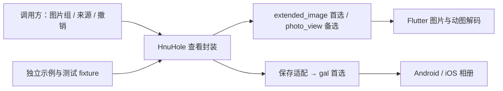

# 通用图片查看组件：复用底层的完整交付计划

创建：2026-10-08。修订：2026-10-10（Asia/Shanghai）。分支：`codex/image-viewer-component`。
状态：`M1_HOST_SCOPE_COMPLETE / PLATFORM_GATES_PENDING`。实现策略：`REUSE_FIRST`。已建立独立技术样例、锁定依赖并执行36项宿主测试；M1双端技术关未完成，M2正式组件尚未开发。用户授权提交/推送本分支、完成换机交接和清理自有缓存。

本修订采用用户2026-10-09提出的完整交付目标：extended_image作为查看内核、gal作为相册保存层，交付独立HnuHole图片查看组件。长图、动图、特殊关闭手势、异常处理、读屏/大字及Android/iOS验收均属正式交付，不能以技术小样完成代替组件完成。前置验证用于确定适配方法与可兑现的支持范围，之后继续完整封装、双端验收和业务接入。Q1/Q2不缩减；文档核对不是项目兼容性或设备验收。GIF兼容转换是待验证、待选择的条件方案，尚未批准为默认行为。

## 1. 目标与独立性

交付一个帖子、评论、私信可共同调用的独立Flutter图片查看组件、示例App、自动化测试、支持范围和双端验收证据。内部复用extended_image、Flutter图片能力和gal，自己维护产品规则与接入逻辑。独立交付指组件开发与验证可以先用本地图片完成，不依赖其他业务开发进度。

调用方提供允许查看的有序图片组、初始索引、图片来源、保存许可和访问失效通知；组件负责查看、界面、生命周期及主动保存反馈。保存许可是业务是否允许导出的能力，不等于系统相册授权；组件在保存时通过gal处理系统权限。独立示例可以完成组件验收，不依赖文字社区T1/T2接口、认证完成或业务SQLite；真实业务接入在M4单独验收。

工作树：`C:/Users/Administrator/.codex/worktrees/image-viewer-component/HnuHole`；起点`0eff47a21cd4f4ab1636b4468f7d5df9769a264f`。原匿名分支更新中的未提交修复没有复制；其历史证据不代证本组件或其他工作树当前状态。主App接入列入整体交付路线M4；待对应业务入口具备媒体能力后执行，不在当前计划修订中修改其他工作树。独立组件正式交付M3与三类业务接入M4分别登记，不能相互代证或合并为已完成。

## 2. 产品需求与来源

- [帖子详情 DETAIL-MEDIA-01](modules/post-detail.md)：双指缩放、双击放大、当前帖组内切图、关闭后父页面位置保持、用户主动保存相册。
- [评论 COMMENT-MEDIA-01](modules/comments.md)：查看该条评论唯一图片，不跨不同评论切图。
- [私信 DM-MEDIA-01](modules/messaging.md)：仅在同次发送的一组图片内切换，不合并整个聊天的图片。
- [发帖 MEDIA-01](modules/post-composer.md)：当前业务每组最多九张；选图、三列缩略图、排序和上传由其他组件负责。
- [UI流程](ui-quality-workflow.md)、[工程基线](../adr/0001-engineering-baseline.md)、[AGENTS](../../AGENTS.md)：图稿评审、测试边界和交接要求。

| ID | 需求/决策 | 当前结论 | 来源与状态 |
|---|---|---|---|
| Q1 | 长图初次显示与关闭 | 按屏幕宽度从顶部上下阅读；只有回到顶部才允许下滑关闭。缩放时移动图片，恢复基准后才参与关闭判断；回顶手势不直接兼作关闭 | CONFIRMED，用户2026-10-08本chat答复及既有缩放规则 |
| Q2 | 动图查看与保存 | 首版支持GIF/动态WebP播放，主动保存时保留动画；不得降成首帧静态图 | CONFIRMED，用户2026-10-08本chat答复 |
| R1 | 单图与多图 | 指定索引进入，当前组内左右切换；单图无假切图，首尾不绕回 | 既有产品规则；首尾策略为工程默认 |
| R2 | 查看操作 | 双指缩放、双击放大/恢复、放大后平移；缩放不误切图或误关闭；关闭按钮与系统返回可用 | 既有产品规则，细节待实际验证 |
| R3 | 保存与反馈 | 当前图片原始文件优先，业务保存许可与系统相册权限分别处理；不浏览即保存、不截屏代替原图。错误可理解、防连点；兼容输出须明确标识 | 既有主动保存边界；GIF兼容转换尚待实测/选择 |
| R4 | 页面与访问 | 关闭后调用方保留原页面位置；访问撤销停止新读取/保存，迟到结果不能污染新图/新会话 | 既有业务隔离要求；组件与调用方分别验证 |
| D1 | 实现路线 | 优先复用现成库，配置/封装处理差异，依据实际失败再选择备选或最小补丁 | CONFIRMED，用户2026-10-09授权改写计划 |
| D2 | 首选路线 | extended_image + gal + Flutter图片能力；photo_view仅作已复现缺口的备选 | HOST_SPIKE_VERIFIED_PLATFORM_PENDING，样例版本已锁、设备行为未验证 |
| D3 | 完整交付 | 技术难点验证 → 完整封装 → Android/iOS验收 → 帖子/评论/私信接入；小样不是最终交付 | CONFIRMED，用户2026-10-09完整方案 |
| D4 | iOS动态WebP兼容 | 原格式相册回放失败时，评估image库生成动画GIF并保留原始来源；不静默转静态或默认双份写入相册 | PROPOSED_PENDING_VALIDATION_AND_PRODUCT_DECISION |

静态格式范围：JPEG/PNG/WebP；动画范围：GIF/动态WebP。HEIF/AVIF/APNG等没有获得专门支持承诺。Android/iOS为产品目标；Windows仅作开发与widget环境。当前宿主iOS部署目标15.0，Android继承Flutter配置；I1核对实际工具和依赖约束，不擅自提高主App最低版本。

原grill-with-docs入口及缺失子技能说明保留在2026-10-08计划检查历史记录。Q1/Q2已经确认，本次只改工程路线，不重新访谈这些需求。

## 3. 复用方案与选型依据

以下为2026-10-09官方/作者文档核对，不是已实现状态；首选底层路线已确定，实际接受版本与适配方案由I1验证后固定。发现大范围改库需求时先交付问题与成本报告，再决策路线。

| 能力 | 优先候选 | 已有文档能力 | 项目仍需验证 |
|---|---|---|---|
| 查看、手势、多图、加载/失败、滑动退出 | [extended_image](https://pub.dev/packages/extended_image) | 提供缩放/平移、图片组及滑动退出能力 | 长图顶部初始位置、回顶后才能关闭、与切图的手势竞争及当前SDK兼容 |
| 查看备选 | [photo_view](https://pub.dev/packages/photo_view) | 提供缩放/平移和PhotoViewGallery | 首选失败时比较缺口/改动成本，不默认同时引入两套 |
| 图片/动画解码 | [Flutter Image](https://api.flutter.dev/flutter/widgets/Image-class.html) | 官方列出Animated GIF和Animated WebP支持 | 当前库组合实际逐帧播放、后台/不可见停止及资源边界 |
| 相册保存/权限/错误 | [gal](https://pub.dev/packages/gal) | 提供Android/iOS保存、文件/字节输入及权限/错误处理 | 动图完整文件保存与相册回看、错误类别、保存竞争及最小权限 |
| 条件动图兼容 | [Dart image](https://pub.dev/packages/image) | 文档列出动画WebP/GIF能力；[decodeWebP](https://pub.dev/documentation/image/latest/image/decodeWebP.html)/[encodeGif](https://pub.dev/documentation/image/latest/image/encodeGif.html)可作为验证起点 | 帧合成/透明/循环、帧时间精度、体积、峰值内存与耗时；仅在有必要且方案确定后引入 |

首选组合是选型起点，不承诺下载后零适配，也不因包自称支持某平台就登记本项目PASS。I1对最终候选核对许可证、传递依赖、SDK下限、维护/变更记录和API；与仓库Flutter/Dart版本编译匹配后，在pubspec与锁文件固定可复现版本。不能照抄README中的旧版本示例，不用浮动latest或未固定Git分支代替选型。

## 4. 实现责任与最小封装

拟新增普通Flutter包`packages/image_viewer/`与`packages/image_viewer/example/`。包依赖选定的现成库/插件；默认不创建自研Android/iOS相册插件。示例是独立App，其平台目录用于权限与设备验证，有自己的applicationId/bundleId。

| 责任 | 处理方式 |
|---|---|
| 底层缩放/平移/图片组手势 | 配置选定查看库，复用控制器与状态，不另造通用手势引擎 |
| 静态/动画图片解码 | 使用Flutter与库已有图片能力，不自研解码器或动画播放器 |
| 相册写入/平台权限 | 封装gal等选定插件的API及结果，不默认自写原生桥 |
| Q1长图适配与关闭条件 | 集中维护手势开始时的关闭资格；公开API优先，必要时评估针对这一行为的最小固定补丁 |
| 图片组/界面/关闭与访问代次 | 产品规则封装、UI和回调，与调用方组合 |
| 条件动画GIF兼容 | 复用image库；原文件不覆盖，转换质量/性能必须验证，不自写编解码器 |
| 保存连点、原文件、失败与迟到结果 | 保存适配层；插件不能取消已提交平台写入时，明确该限制并核对结果 |
| 真实来源授权/会话/业务缓存 | 调用方负责；组件不获取账号或令牌、不调用帖子后端 |

拟定接口在I1根据库API收敛：`ViewerItem`（稳定ID、图片来源、可选读屏说明）、查看入口（图片组/初始索引/保存许可/访问失效通知）、完整文件取得能力、相册保存适配器、关闭结果。优先复用`ImageProvider`和现成控制器，只有测试证明需要时才增加自定义controller或resolver层。拟定名称不是已有API。

组件不接收Bearer/密码/恢复材料或内部accountId。受保护远端图片由调用方加载；组件不会复制认证header。默认不用库的公开NetworkImage示例代替受保护来源，也不启用与需求无关的长期磁盘缓存。

## 5. 需要适配的行为

1. 普通图基准为完整适屏且居中；长图基准为宽度适配，从顶部开始，使用库配置/最小布局适配实现。
2. 长图非顶部的上下拖动用于阅读。手势开始时确定关闭资格：已在顶部、处于该图基准缩放且为单指下拉，才可进入退出；中途回顶不能获得资格，必须全部松手后开始新下拉。阅读回顶过程既不能关闭，也不能误出现退出缩小/淡背景。放大平移、双指缩放/中途增指、惯性回顶均不能转为关闭；基准是当前适屏/适宽布局，不硬编码成原图物理像素1:1。I1验证公开API的时机与状态，I2集中实现、固定阈值与取消行为。只在slideEndHandler拒绝pop不足以证明全过程正确。
3. 基准尺度下水平切图，长图竖向优先阅读；双指/双击和放大平移不触发切图或关闭。单图、首尾和取消下拉均有明确行为。
4. 本次查看会话按稳定ID保留已看图片的阅读状态；关闭后清会话。旋转保留当前图及可恢复锚点。调用方保留帖子/评论父页面位置。
5. 加载失败只影响当前图，显式重试；关闭、切图、替换组或访问撤销后抑制旧回调。实际读取取消能力以来源/库API为准，不虚构取消已完成操作。
6. GIF/动态WebP保留帧时长与循环语义。只调度当前可见图片；切走、后台、关闭或撤销时通过库/Flutter生命周期停止非可见播放与释放资源。无法实现的细节须记录复现，再选最小补丁。
7. 提供关闭、序号、保存与读屏替代切图操作；大字、安全区、错误提示可操作。中性深色查看背景可配置，不推定主App全局配色已定；图稿/实际截图按项目UI流程评审。
8. I1确定待测预算，I4用设备量测固定支持的文件字节、宽高/像素、动画帧数/时长、解码/邻图及转换资源范围。查看不一次性解码整组原图；条件转换需单独预算，不能假设移到isolate就减少内存或可无界处理全部帧。超过支持范围可关闭/切图并明确失败，不偷偷删帧、缩成静态或伪装成功。最终交付写明Android/iOS系统与设备范围，不承诺无限大图片或所有相册App。

## 6. 保存、条件兼容与失败边界

只在显式保存点击后取得当前图片完整来源文件，并调用gal。业务不允许保存时不启动文件取得、转换或相册写入，反馈与界面按统一入口处理。默认优先保留原格式文件路径，不截屏、不重编码成静态图；纯查看不申请整个相册读取权限。

### 原始保存与系统回放分别验收

I1先验证GIF/动态WebP原格式路线。App内播放、插件调用结果、输出文件的动画完整性、系统相册实际回放分别记录；相册缩略图和插件返回成功不能代证动画回放。[gal格式说明](https://github.com/natsuk4ze/gal/wiki/Formats)依赖OS支持，[文件保存实践](https://github.com/natsuk4ze/gal/wiki/Best-Practice)建议保留文件扩展名；[Apple GIF说明](https://support.apple.com/en-ae/118278)不是动态WebP经本组件导入的保证。

iOS原格式失败时，保持Q2未完成状态并报告复现。不得把“平台有限制”当作组件已完成的理由，也不得以Flutter能播放推断相册支持。Android不同目标相册的回放同样按实际验证范围声明。

### 条件动画GIF方案

若iOS原动态WebP不能达到相册动画回放，I1可验证用image库生成动画GIF；当前只是兼容建议，不是已批准的默认产品行为，不在正式组件中悄然开启。转换验证必须覆盖完整帧合成/帧数、透明与背景、颜色量化、帧时间误差、有限/无限循环、文件大小、耗时、峰值内存、后台/关闭/访问失效的迟到结果。

image库提供所需格式能力不等于动画完全等价或所有输入能低成本转换。所查公开源码[WebP解码](https://github.com/brendan-duncan/image/blob/main/lib/src/formats/webp_decoder.dart)和[GIF编码](https://github.com/brendan-duncan/image/blob/main/lib/src/formats/gif_encoder.dart)仅作为候选实现分析，最终必须核对锁定发布版本并用fixture验证；循环元数据需专门映射检查，不能只测试能生成文件。

验证后提交实际质量预览、资源数据、支持上限与用户可理解的保存提示，再确定是否接受兼容GIF。需要改变透明背景、缩小尺寸、降低帧数/帧率或其他可见效果时明确列出，不从“保留动画”推导无限制降质授权。若不能接受或不能满足，技术关保持未通过，并给出原文件导出等可行选择；不能静默放弃需求。

“同时保留原文件”先表示不覆盖/损坏调用方原始来源；不据此授权永久复制受保护原图、相册自动写入两份或长期留存撤销后的私有缓存。若需要额外导出或长期保留，待具体兼容方案中明确产品行为与清理范围。兼容输出须标识为GIF，不能声称它仍是原始WebP。

### 保存竞争、撤销与清理

同一保存未结算时抑制连点；明确完成后提示成功。来源读取失败、权限拒绝/撤销、格式不支持、空间不足或写入失败按可识别类别反馈，保留查看操作；未知结果不自动再写入。相册权限撤销影响保存；业务访问失效由调用方通知，组件停止展示与新读取/保存，二者不混为同一事件。

关闭/失效发生于调用插件前时停止新保存；已调用插件并交给系统写入时，按API能力与最终结果处理，不能承诺取消不可撤销的写入。关闭后不显示迟到toast，不改变新会话；不会因结果未知自动重试。已经成功导出的用户相册副本不能承诺因业务撤销自动收回。

只建立本任务独立临时文件，完成/失败后的清理依据系统使用完成时点；不删除用户相册、调用方原文件或未知缓存。日志不含URL、原图、完整私有路径或底层异常。缓存隔离/失效与动画停止分别验证；不以清空所有全局缓存代替正确资源管理。媒体上传和元数据治理仍由对应业务模块负责。

## 7. 四个正式里程碑与停止条件

M1–M4是整体交付路线；保留I0–I5工程编号并新增I6承接业务接入，不改已有MIV编号。当前I1/M1宿主技术样例与本机可执行检查已完成；平台构建有工具阻塞，手机技术关按用户指令未执行。I2–I6/M2–M4尚未开始，完整交付退出条件不变。

| 正式里程碑 | 工程阶段与完整产物 | 必须满足的退出条件 |
|---|---|---|
| M1 技术难点验证 | I1独立小型工程、场景图片与记录；长图手势、动图停止、Android/iOS原格式保存/相册回放；必要时GIF兼容质量与性能试验；许可证/API/SDK核对 | 三道技术关按目标平台有真实证据；固定版本、适配方式、支持边界。若需兼容，明确实际取舍；大范围改库先重新决策。小样PASS只证明技术可行，不能代替组件交付 |
| M2 完成独立组件 | I2产品适配与I3相册保存；统一接口/README/独立示例、普通/长图、缩放/平移/组内切图、严格关闭手势、GIF/动态WebP、保存许可/系统权限/连点/错误、生命周期、按钮/返回/序号、读屏/大字与自动化测试 | 全部约定功能有正式实现和必要测试源码；已选兼容方案亦完整实现。缺平台证据登记“实现完成/验收待执行”，不能称正式验收完成 |
| M3 Android/iOS验收与组件正式交付 | I4集中设备验证及I5交接；触摸/旋转/读屏/大字、快速切图、前后台、保存中关闭、权限拒绝/撤销、访问失效、故障/资源、系统相册实际回放 | MIV01–MIV13对全部约定支持范围有通过证据，含两端动图；版本/设备/系统/尺寸/帧数上限清楚。任何必需项NOT_RUN/BLOCKED/FAIL时，完整组件验收仍未完成。形成可供业务接入的正式交付版本；提交/推送/对外发布按当次授权执行 |
| M4 业务接入与维护 | I6帖子传当前帖组、评论传本条单图、私信传同次发送组；真实来源/保存许可/访问失效/父页面位置；维护依赖升级回归 | MIV14按三类调用方逐项验证；业务入口尚未具备时保留依赖状态，不能称整体接入完成。升级重跑手势、动图、保存及受影响回归，不重建查看器 |

M1的三道技术关：①严格长图退出及缩放/切图竞争；②Android/iOS GIF/动态WebP原格式或已确定兼容输出的实际保存与相册回放；③切图/后台/关闭/失效后的动图与异步状态。每关记录公开API能解决的范围、适配代码、失败复现和支持上限。I1允许建立最小gal/image调用用于探路，不等待完整封装。

执行顺序I0 → I1 → I2/I3 → I4 → I5 → I6。缺iPhone/macOS时可继续不依赖它的验证和源码工作，iOS为NOT_RUN/BLOCKED；M1双端可行性结论与M3正式验收不能凭Android补齐。双端验收始终属于正式交付，不以“以后再补”收尾。

首选缺口先尝试配置/公开API与集中产品状态控制，再比较针对失败点的备选或最小固定补丁。小补丁须有复现、版本/许可证、明确变更范围、回归与上游升级处理。若需长期大fork、重写多指手势仲裁、自研解码器或大范围原生桥，停止扩大实现，先交付成本、替代方式与产品取舍；不能默默把路线变回自研。常规工程适配自主推进；改变已确认交互或保存可见效果时再就具体方案确认。I1实测后估算工时，不先承诺日历日期。

## 8. 固定验收矩阵

MIV01–MIV14编号与证明范围保留。当前完整MIV01–MIV14仍NOT_RUN；已建立M1样例并取得部分场景的宿主PASS，不代证完整封装、平台或业务接入。实际映射、源码/测试与未验原因见台账IV01及M1报告。

| ID | 关键场景 | 证据 |
|---|---|---|
| MIV01 | 空组/错误索引/重复ID/来源无效，单图与指定索引组内多图 | 封装unit/widget，失败能关闭 |
| MIV02 | 普通/透明/EXIF/长宽小图，GIF/动态WebP帧时序/循环/不可见与后台停止 | 库组合fixture、渲染与动图帧变化证据 |
| MIV03 | 长图按宽度顶部进入/阅读；手势开始资格锁定、回顶同手势不退出/不出现退出动画、松手后新下拉关闭 | widget与两端真实触摸，首选选型重点 |
| MIV04 | 双指/双击、放大平移、缩放不误切图/关闭 | 库配置与适配的widget/真实触摸 |
| MIV05 | 组内切图、首尾/单图、按ID阅读状态 | widget，仅调用方本次图片组 |
| MIV06 | 按钮/系统返回/下拉取消，父页面位置保持 | 独立示例，不能代证真实帖子详情 |
| MIV07 | 损坏/超大/加载失败/手动重试/旧回调 | 最小故障fixture与资源记录 |
| MIV08 | 业务访问失效与相册权限撤销分别处理；换组/后台/旋转、旧读取/保存不污染新会话，非当前动图停止 | fixture/widget/device，不代证真实后端授权 |
| MIV09 | Android静态/GIF/动态WebP保存及实际回放，保存许可/权限拒绝/格式不支持/失败，查看不写相册 | 插件结果、输出文件动画检查与目标系统相册实际回放分别记录 |
| MIV10 | iOS静态/GIF/动态WebP保存及回放，必要的已批准兼容GIF质量/循环/帧时序/资源，权限/拒绝/中断/连点 | macOS/Xcode与iPhone真机、动画文件检查与Photos实际回放；原格式失败不能记需求PASS，兼容待选择也不能关闭缺口 |
| MIV11 | 保存连点/未知/关闭竞争与临时文件清理 | 插件适配fault tests/设备；替身不代证平台 |
| MIV12 | 小屏/大字/安全区/读屏替代动作/横竖屏 | widget截图与实际设备/读屏 |
| MIV13 | 解码/邻图/动画/条件转换预算，反复开关/超长图/高帧数；明确支持边界及超限反馈 | 两端设备量测，M3固定字节/尺寸/帧数/时长与资源上限 |
| MIV14 | 真帖子组/本条评论单图/同次私信组，受保护来源、保存许可、会话/访问失效与父页面位置 | 整体路线M4必需项；与M3独立组件验收分开，业务未就绪保持NOT_RUN/依赖状态 |

测试只覆盖实际配置、HnuHole差异与关键组合，不复制上游完整测试套件，不写大量镜像测试。显示/保存/设备结果按实际版本逐项映射，库官方PASS不能迁为本项目PASS。

## 9. 工程落点与并行边界

已建立M1技术样例（不是完整组件）：`packages/image_viewer/lib/`、`test/`、`example/`及示例`integration_test/`。依赖及锁文件属于本包/示例。本包`android/`、`ios/`不再列为必建路径；只有必要自定义插件补丁才能增加，已选插件的原生源码维护在其依赖中。

已经执行的宿主命令及后续平台命令：在本包`flutter analyze`、`flutter test`；在示例`flutter analyze`、`flutter build apk --debug`，设备条件明确后`flutter test integration_test/image_viewer_device_test.dart -d <device-id>`。宿主分析/测试及示例bundle实际已执行；APK/iOS原生与设备命令尚未运行，不编造模块参数。iOS构建/测试命令由实际示例工程固定，Windows文档检查不代证iOS链接或相册。

使用现成SDK和本任务独立示例/fixture；不占原vivo匿名验收App、代理、数据库与Gate材料。缺设备可登记待验，不自动借用正在执行的共享环境。主Apppubspec/manifest/路由、认证controller及auth_vault/auth_passkey、Go/SQL/OpenAPI、媒体上传不在本片变更范围。后续接入通过统一封装对接，依赖清单/权限配置届时审查。

## 10. 交接与本轮检查

稳定模块IV01关联B06/B07/B09与X05。修订本计划、[模块交接](module-acceptance-handoff.md)、[台账](module-acceptance-ledger.json)、[HANDOFF](HANDOFF.md)、[progress](progress.md)及产品模块中的实现路线说明；既有匿名/业务记录保持原版本与状态。

2026-10-10执行M1本机可行部分：独立技术源码、示例、锁文件、合成fixture、36项Windows宿主测试、本包/示例分析、bundle编译、许可证/发布源码审查和条件GIF试验。实际范围与缺口见[报告](image-viewer-m1-report.md)、[机器记录](image-viewer-m1-verification.json)和[换机入口](image-viewer-machine-handoff.md)。历史计划检查保留在image-viewer-planning-verification.json，不能代证当前源码/新修订。

M1未整体完成：Android原生构建缺现成Gradle缓存；iOS需Mac/Xcode；用户要求本轮不参与手机，真实触摸、权限、保存和相册回放NOT_RUN。兼容GIF仅实验，半透明默认拒绝；未批准产品转换。M2完整组件、M3正式双端验收、M4三类业务接入均未开始。用户后续明确授权把已做内容提交/推送对应GitHub分支，做好交接并删除本任务缓存；保留现成SDK、其他任务缓存、源码/锁文件/fixture/小型证据。实际远端SHA与清理结果以Git和机器记录为准。
