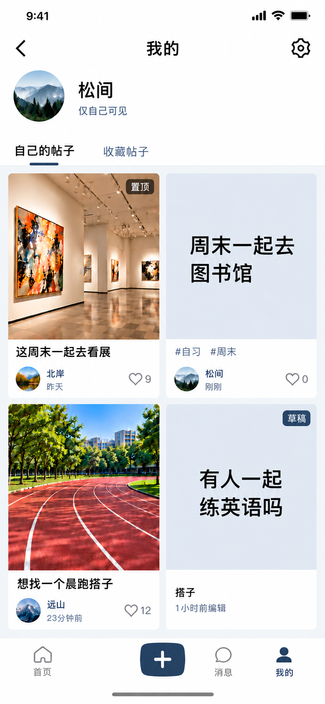

# F1-11 我的正常列表：对齐版 v3

日期：2026-10-09。状态：DRAFT / 已展示；新版本不自动继承旧版本批准。

用户要求“还有哪些没有画完？一次性画完”。核对原清单后，无尚未出图的独立页面；本次收口既有正常列表候选，未扩大到搜索、评论、消息、设置等模块。

## 本次变更

置顶看展帖移到首位；普通正式帖与草稿按既定时间排序。正常列表继续用两列按行对齐网格；各封面容器大小、行底边及页脚对齐，图片按比例缩放裁切到统一预览框，点开按完整原比例查看。草稿只显示草稿标签、通道和编辑时间，不伪造公开身份或点赞。

白色框架、黑色主文字、暗灰蓝按钮和页签强调、头像区、两个页签与底栏沿用参考。仅 F1-11 更新；已选定的 F1-16／17 状态图不替换。正常列表的置顶顺序是产品规则，不能由旧 v2 置顶在第二项的示例推定新规则。

## 技能与生成

应用项目 hnuhole-ui-craft、frontend-design、ui-ux-pro-max 和 imagegen；检索 consistent thumbnail grid alignment 的结果只涉及文字层级与帮助位置，未作为缩略图比例的来源。统一缩略图直接依据用户指令。

参考：my-content-aligned-v2.png。内置 imagegen 编辑，原始输出 exec-27439fbd-97f1-423e-ab0b-d8e916e35a39.png；原图按字节复制，无 Python 图像编辑。

提示词：保留白色“我的”原版头部、头像与底栏；置顶看展卡片移到左上，文字图书馆帖移到右上，跑步与普通草稿在第二行。四卡等宽、封面等尺寸、行顶底和页脚对齐，图片按比例 cover 裁切不拉伸。保留黑色中文和暗蓝强调。草稿无作者、无点赞，不添加发布中或失败状态。

## 复审与证据范围

实际查看生成结果：置顶已首位、两行卡片和页脚对齐、四个预览框等尺寸，所有中文信息可读，原白色框架保留。生成提示词曾提出 1:1，但输出预览接近略竖向矩形；本次不将“精确方形”或像素级比例记为已验证。用户要求的重点是相同显示角色预览等尺寸且原图不拉伸；实际组件必须使用共享尺寸与比例约束，点开完整原图，禁止随每张源图宽高改变卡片高度。详情定稿的方形三图不改。

仅静态图复审，Flutter渲染、图片原比例查看、排序、路由和设备验收均 NOT_RUN。没有业务代码变更，不修改模块验收台账或旧通过记录。

SHA-256：`b7c7841e6c00bc434ab5adc305369594a632c640c265d07bce94e4d6e0d93ea5`。
